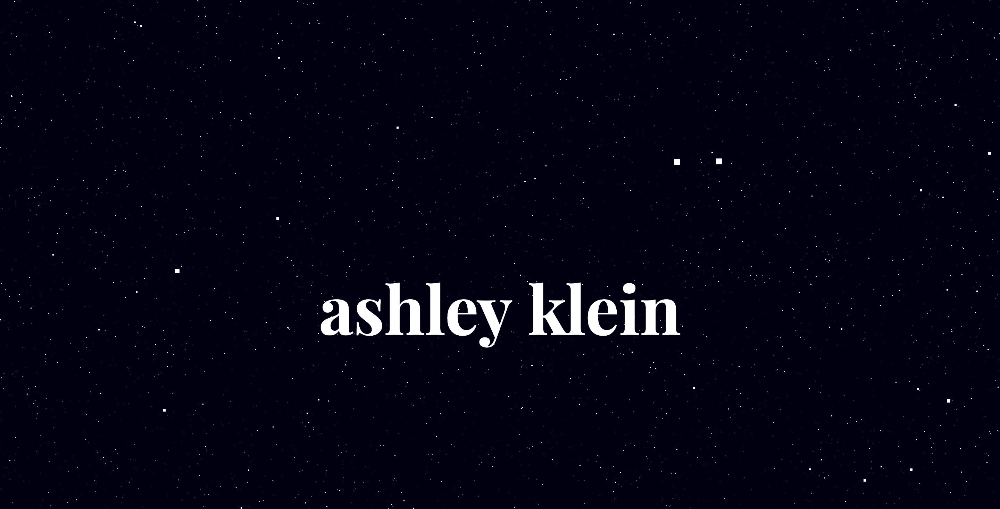
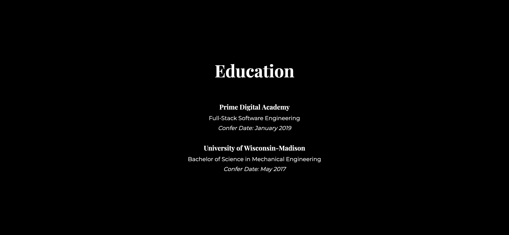

# Personal Site

This is an application created with three.js and jquery. It features animations to display information in a clean and concise way.

## Built With

JavaScript, Node.js, Three.js, jQuery

## Screenshots

The landing page features a galaxy animation of stars.

## Getting Started

To get a copy of this personal-site running on your local machine:

1. Download this project.
2. Install node modules using `npm install`.
3. Start site with `npm start` in terminal.

### Prerequisites

- Node.js
- NPM

### Completed Features

- [x] Three.js galaxy animation

### Next Steps

- [ ] Animation of text to time entry.

## Authors

* Ashley Klein
